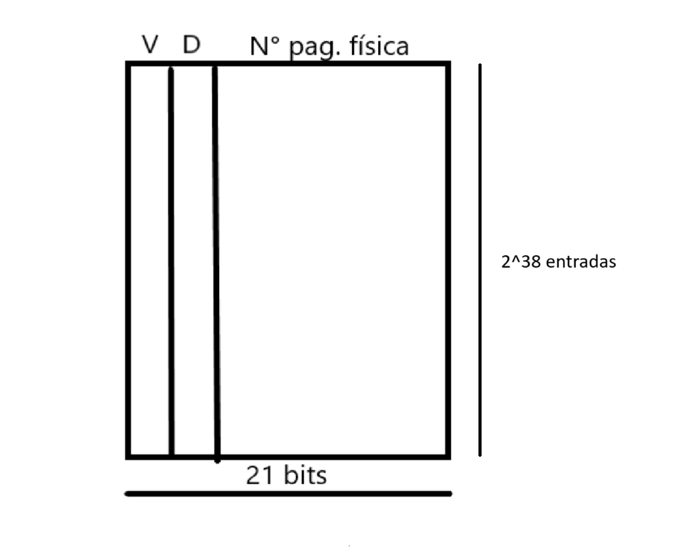

# Ejercicio 03

## a) ¿De cuántos bits es la dirección física?

El espacio de memoria RAM es de 2GB. Eso es $2^{31}$ bytes, entonces la cantidad de bits de la dirección física es 31.

## b) ¿Cuál es el número máximo de páginas virtuales en el sistema?

El tamaño de la memoria virtual es $2^{50}$.
El tamaño de una página es $2^{12}$.
Entonces la cantidad de páginas es $\frac{2^{50}}{2^{12}} = 2^{38}$.

## c) ¿Cuántas páginas fı́sicas hay en el sistema?

El tamaño de la memoria física es de $2\text{GB} = 2^{31}$. 
Entonces la cantidad máxima es $\frac{2^{31}}{2^{12}} = 2^{19}$.

## d) ¿De cuántos bits son los números de página virtual y fı́sica?

A partir de los apartados b) y c) podemos determinar que la cantidad de bits son 38 bits para las páginas virtuales y 19 para las físicas.

## e) ¿Cuántas entradas de la tabla de páginas contendrá la tabla de páginas?

Como vimos en el apartado b), la tabla de página va a tener $2^{38}$ entradas.

## f) Suponga que, además del número de página fı́sica, cada entrada de la tabla de páginas también contiene información de estado en forma de un bit válido (V) y un bit sucio (D). ¿Cuántos bytes tiene cada entrada de la tabla de páginas? (Redondee a un número entero de bytes).

Como vimos en el apartado d) utilizamos 19 bits para las direcciones físicas. Luego agregamos el bit válido y el bit sucio. Entonces cada entrada es de 21 bits = 3 bytes (aprox).

## g)

## h) ¿Cuál es el tamaño total de la tabla de páginas en bytes?

En el apartado f) determinamos que una entrada de página ocupa 3 bytes, y en el b) la cantidad de páginas virtuales máxima.
Entonces el tamaño total de la tabla es $2^{38} \cdot 3$ bytes (aprox).
